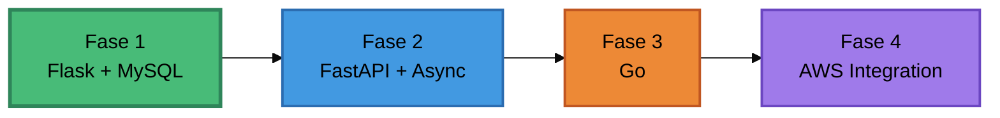

# Asgard Transactions API


> Experimento de aprendizaje: construir el mismo servicio de transacciones con diferentes tecnologías

API REST para transacciones de pago (AUTH/CAPTURE/REFUND) implementada múltiples veces con distintos stacks para comparar arquitecturas, performance y trade-offs.

**[Ver implementación Flask](../../tree/v1-flask)** · [Roadmap](#roadmap) · [Cómo navegar](#cómo-navegar)

---

## El plan

Construir el mismo servicio 3-4 veces con tecnologías diferentes para entender qué funciona mejor antes de decidir el stack definitivo.

**Por qué:** Quiero entender a fondo APIs de transacciones y comparar stacks reales en vez de solo leer documentación.

**Estrategia:**
1. Implementar con Flask (base sincrónica)
2. Reimplementar con FastAPI (async, validación automática)
3. Reimplementar con Go (lenguaje compilado, concurrencia nativa)
4. Elegir el mejor stack e integrarlo en un ecosistema de microservicios en AWS

**Qué hace el servicio:**
- **AUTH** - Autoriza y reserva fondos
- **CAPTURE** - Captura fondos reservados
- **REFUND** - Devuelve fondos al cliente

Incluye validación de flujo, idempotencia, manejo de estados.

> Este NO es el proyecto final. Es un laboratorio para aprender experimentando. El objetivo es comparar y documentar aprendizajes.

---

## Roadmap



### Fase 1: Flask + MySQL

**Stack:** Python, Flask, MySQL, Docker

**Objetivo:** Entender fundamentos de APIs de transacciones con un stack simple y directo.

**Alcance:**
- CRUD completo
- Validación de reglas de negocio
- Idempotencia
- Arquitectura en 3 capas

**Aprendizajes:**
- Diseño de APIs REST
- Flujos de transacciones
- Separation of concerns
- Connection pooling

**Estado:** Completado → **[Ver implementación v1-flask](../../tree/v1-flask)**

---

### Fase 2: FastAPI + Async

**Stack:** Python, FastAPI, PostgreSQL

**Objetivo:** Comparar approach asíncrono vs síncrono. Ver si OpenAPI automático y Pydantic valen la pena.

**Alcance:**
- Reescritura completa con async/await
- Validación automática con Pydantic
- OpenAPI docs automáticas
- Comparativa de performance

**Métricas a comparar:** Latencia, throughput, complejidad del código

**Estado:** Próximamente

---

### Fase 3: Go

**Stack:** Go, Gin/Echo, PostgreSQL

**Objetivo:** Salir del ecosistema Python. Comparar lenguaje compilado vs interpretado.

**Alcance:**
- Reescritura completa en Go
- Goroutines y concurrencia nativa
- Comparativa con versiones Python

**Métricas a comparar:** Tiempo de desarrollo, performance, uso de memoria

**Estado:** Planificado

---

### Fase 4: AWS Integration

**Stack:** AWS, Terraform, ECS/EKS

**Objetivo:** Integrar el servicio (con el stack elegido) en un ecosistema de microservicios productivo.

**Alcance:**
- Arquitectura de microservicios
- Domain-Driven Design
- Infraestructura como código
- CI/CD, observabilidad

**Estado:** Objetivo final

---

## Implementaciones

| Rama | Stack | Estado |
|:-----|:------|:-------|
| **[v1-flask](../../tree/v1-flask)** | Flask + MySQL | Completado |
| v2-fastapi | FastAPI + PostgreSQL | Próximamente |
| v3-go | Go + PostgreSQL | Planificado |

Cada rama tiene código completo, README con documentación, ejemplos de uso y aprendizajes.

---

## Cómo navegar

**Ver una implementación:**
```bash
git clone https://github.com/KatzeeDev/asgard-transactions-api-rest.git
cd asgard-transactions-api-rest
git checkout v1-flask      # o v2-fastapi, v3-go
```

**Comparar implementaciones:**
```bash
git diff v1-flask v2-fastapi                 # ver cambios
git diff --stat v1-flask v2-fastapi          # ver estadísticas
```

**Estructura de branches:**
```
main         → Plan general (estás aquí)
├── v1-flask → Implementación Flask
├── v2-fastapi → Implementación FastAPI
└── v3-go      → Implementación Go
```

---

**[Ver implementación Flask](../../tree/v1-flask)** · [Issues](../../issues)
