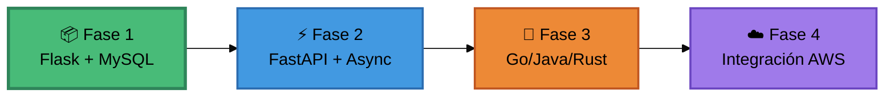

<div align="center">

# Asgard Transactions API

### MVP Experimental · Laboratorio de Aprendizaje

[](https://opensource.org/licenses/MIT)
[](https://github.com)
[](https://www.python.org)
[](https://flask.palletsprojects.com)
[](https://www.mysql.com)
[](https://www.docker.com)

**Microservicio experimental para aprender arquitecturas REST antes de construir el proyecto definitivo**

[El Plan](#-el-plan) · [Roadmap](#-roadmap) · [Stack](#-stack-tecnológico) · [Inicio Rápido](#-inicio-rápido)

---

</div>

## El Plan

Este proyecto es un **MVP experimental** diseñado para aprender construyendo el mismo servicio múltiples veces con diferentes tecnologías.

### ¿Por qué hacer esto?

**Objetivo principal:** Entender a fondo sistemas de transacciones y APIs REST experimentando con diferentes stacks tecnológicos antes de tomar decisiones para el proyecto definitivo.

**Estrategia:**
1. Construir el mismo servicio de transacciones 3-4 veces
2. Cada iteración usa una tecnología diferente (Flask → FastAPI → Go/Java/Rust)
3. Documentar aprendizajes, comparar rendimiento y complejidad
4. Identificar trade-offs de cada approach

**¿Qué pasa después?**
Una vez completadas las iteraciones y con el conocimiento adquirido, este componente se integrará como parte de un **ecosistema de microservicios mayor en AWS** (proyecto Asgard), aplicando las mejores prácticas aprendidas.

> **Nota importante:** Este NO es el proyecto final. Es un laboratorio de experimentación. El código aquí sirve para aprender, no para producción.

---

## ¿Qué es este servicio?

API REST para gestión de transacciones de pago que maneja operaciones básicas:

- **AUTH**: Autorización de pago
- **CAPTURE**: Captura de fondos autorizados
- **REFUND**: Devolución de transacciones

Incluye validación de reglas de negocio, idempotencia, y manejo de estados.

## Roadmap

El plan es iterar sobre el mismo servicio con diferentes tecnologías. **Este roadmap puede cambiar** según lo aprendido en cada fase.



### Fase 1: Flask + MySQL (En Progreso)

**Stack:**   

**Objetivo:** Establecer la base funcional del servicio y comprender fundamentos de APIs REST de transacciones.

**Alcance:**
- Operaciones CRUD para transacciones
- Validación de reglas de negocio
- Idempotencia y manejo de estados
- Containerización básica

**Aprendizajes esperados:**
- Diseño de APIs REST
- Flujos de transacciones
- Patrones de validación
- Arquitectura de capas

---

### Fase 2: FastAPI + Async

**Stack:**   

**Objetivo:** Reescribir completamente el servicio para explorar programación asíncrona y comparar con el approach síncrono.

**Alcance:**
- Migración completa a FastAPI
- Operaciones async/await
- Validación con Pydantic
- Documentación OpenAPI automática
- Migración de MySQL a PostgreSQL

**Aprendizajes esperados:**
- Programación asíncrona en Python
- Diferencias de rendimiento sync vs async
- Trade-offs de validación con tipado fuerte
- Generación automática de docs

**Métricas a comparar:** Latencia, throughput, uso de recursos, complejidad del código

---

### Fase 3: Lenguaje Compilado

**Stack:**  o  o 

**Objetivo:** Salir del ecosistema Python para entender trade-offs de lenguajes compilados.

**Alcance:**
- Reescritura completa en Go (o Java Spring Boot, o Rust)
- Explorar patrones de concurrencia nativos
- Optimización de recursos y latencia
- Comparativa con implementaciones Python

**Aprendizajes esperados:**
- Concurrencia nativa (goroutines, threads, async runtime)
- Gestión de memoria manual vs GC
- Ecosistema de herramientas
- Trade-offs de productividad vs performance

**Métricas a comparar:** Tiempo de desarrollo, curva de aprendizaje, rendimiento, tamaño de binarios

---

### Fase 4: Integración en Ecosistema AWS

**Stack:**   

**Objetivo:** Integrar el servicio (en la tecnología elegida) como componente del proyecto mayor Asgard con arquitectura de dominios.

**Alcance:**
- Arquitectura de microservicios en AWS
- Implementación de bounded contexts (DDD)
- Despliegue en ECS/EKS/Lambda
- API Gateway + Event-driven architecture
- Infraestructura como código (Terraform)
- CI/CD completo
- Observabilidad (CloudWatch, X-Ray, métricas)

**Aprendizajes esperados:**
- Domain-Driven Design en práctica
- Arquitectura distribuida
- Infraestructura cloud
- DevOps y automatización

**Resultado final:** Servicio de transacciones como componente productivo dentro del ecosistema Asgard

---

## Stack Tecnológico

### Actual (Fase 1)

<div align="center">

| Componente | Tecnología |
|:-----------|:----------:|
| **Lenguaje** |  |
| **Framework Web** |  |
| **Base de Datos** |  |
| **Containerización** |   |
| **Workflow** |   |

</div>

### Tecnologías Futuras Contempladas

<details>
<summary><b>Ver roadmap de tecnologías</b></summary>

<br>

**Fase 2 - FastAPI:**


**Fase 3 - Lenguaje Compilado:**


**Fase 4 - Cloud & DevOps:**


</details>

---

## Estado Actual

**Fase:** 1 - Flask MVP
**Progreso:** 

### Implementado

- [x] Estructura base del proyecto
- [x] Configuración Docker Compose
- [x] Schema de base de datos
- [x] Endpoint POST `/transactions` (AUTH, CAPTURE, REFUND)
- [x] Validación de reglas de negocio
- [x] Idempotencia (`merchant_id` + `order_reference`)
- [x] Connection pooling MySQL

### Pendiente

- [ ] Endpoints GET (consulta de transacciones)
- [ ] Endpoints PATCH (actualización de estado)
- [ ] Tests unitarios y de integración
- [ ] Documentación OpenAPI
- [ ] Logging estructurado
- [ ] Manejo avanzado de errores

---

## Inicio Rápido

### Prerequisitos


### Instalación

```bash
# Clonar repositorio
git clone https://github.com/KatzeeDev/asgard-transactions-api-rest.git
cd asgard-transactions-api-rest

# Levantar servicios
docker-compose up -d

# Ver logs
docker-compose logs -f app

# Verificar estado
docker-compose ps
```

---

## Estructura del Proyecto

```
asgard-transactions-api-rest/
│
├── src/                    # Código fuente
│   ├── app.py             # Aplicación Flask y rutas
│   ├── db.py              # Capa de acceso a datos
│   └── utils.py           # Utilidades
│
├── db/                     # Scripts de base de datos
│   └── init.sql           # Schema DDL
│
├── docker-compose.yml      # Orquestación de servicios
├── Dockerfile             # Imagen Docker
└── requirements.txt       # Dependencias Python
```

---

## Workflow de Desarrollo

**Estrategia:** GitFlow

| Branch | Propósito |
|:-------|:----------|
| `main` | Releases estables |
| `develop` | Desarrollo activo |
| `feature/*` | Nuevas funcionalidades |
| `hotfix/*` | Correcciones urgentes |

---

<div align="center">

**Proyecto experimental de aprendizaje**


</div>
